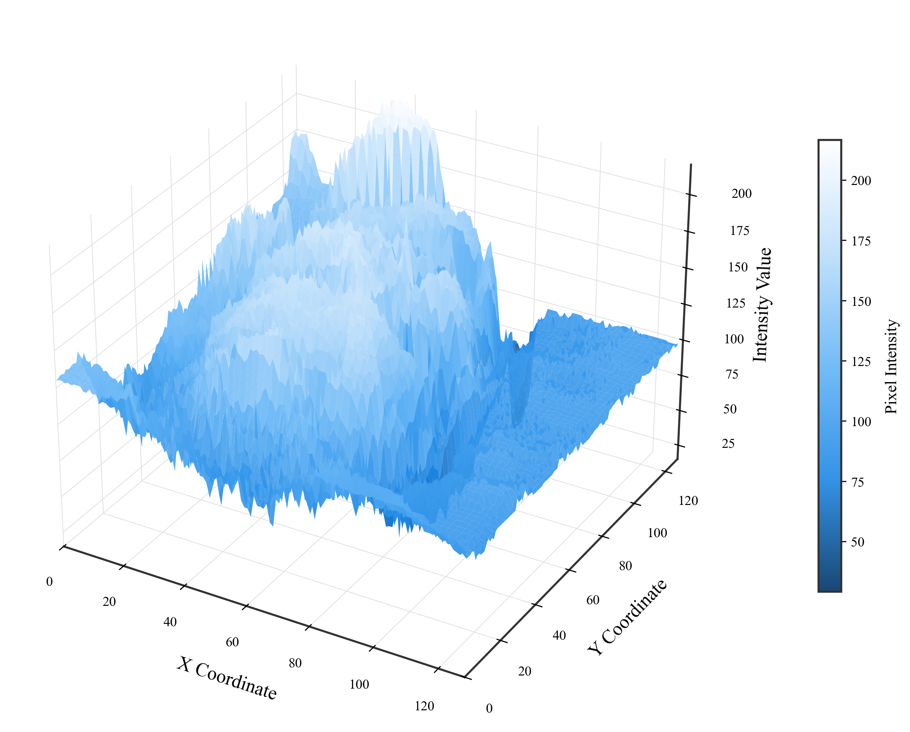

# 🧰 MiniPyTools

A curated collection of small but handy Python scripting tools used in daily work, automation, and experimental workflows.

These tools are lightweight, reusable, and easy to extend for various tasks such as file processing, data cleaning, image analysis, and system scripting.

> Some commonly used small Python tools for real-world productivity and research support.


# 📽️ Image-Video Converter

A simple and efficient Python tool to:

- 🖼️ Convert a folder of images into an MP4 video.
- 🎞️ Extract every frame from an MP4 video into individual image files.

This project is useful for tasks like timelapse creation, video frame analysis, dataset generation, and basic multimedia processing using `OpenCV`.

## 🔧 Features

- Supports `.jpg`, `.jpeg`, and `.png` image formats
- Automatically sorts images before creating the video
- Outputs video in `.mp4` format using the `mp4v` codec
- Extracts all frames from a video into a specified folder
- Lightweight and easy to use — perfect for scripting and automation

## 🛠️ Requirements

- Python 3.x
- `opencv-python` package

Install via pip:

```bash
pip install opencv-python
```

## 🚀 Usage

### 1. Convert a folder of images to an MP4 video

```python
from image_video_converter import images_to_video

# Example: Create a video from images in 'image_folder', save as 'output_video.mp4'
images_to_video("image_folder", "output_video.mp4", fps=30)
```

# 🖼️ Image Resizer

A simple Python tool to batch resize images in a folder to a specific width and height (m × n).

Ideal for preprocessing datasets, standardizing image sizes for ML tasks, or simply resizing multiple images at once.

## 🔧 Features

- Batch resize `.jpg`, `.jpeg`, and `.png` images
- Customize output size with height (`m`) and width (`n`)
- Saves resized images to a separate output folder
- Uses `OpenCV` for fast and reliable image processing

## 🛠️ Requirements

- Python 3.x
- `opencv-python` package

Install with:

```bash
pip install opencv-python
```

## 🚀 Usage

### Import and Call the Function

```python
from image_resizer import resize_images

# Example: Resize all images in 'input_folder' to 256x256 and save them to 'resized'
resize_images("input_folder", "resized", 256, 256)
```

# 📊 Image to 3D Surface Plot

将任意灰度图像转换为三维表面图（3D surface plot），并保存为高质量图像。  
适用于图像可视化、图像处理教学演示、学术论文图表制作等专业场景。

---

## 📌 特性

- ✅ 将图像像素强度映射为 3D 高度信息  
- 🎨 专业美术风格（Times New Roman 字体、柔和配色、白色背景）  
- 🖼️ 自定义渐变 colormap（深蓝 → 白）  
- 📈 高分辨率图像输出，适用于论文插图  
- 🧠 支持任意图像格式，自动转为灰度处理  

---

## 🖼️ 可视化示例

> 运行后会生成类似如下的图像：

<p align="center">
  
</p>

---

## 📦 安装依赖

```bash
pip install numpy matplotlib pillow
```
